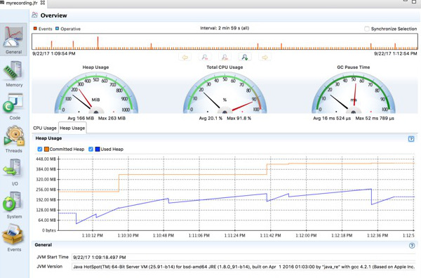

# Java Flight Recorder Wercker Step Sample

This project demonstrates how to use the Java Flight Recorder Wercker Step to collect a
recording of your application's execution. 

## Usage

Do stuff.. 

You can now open your recording in Java Mission Control as in the example below:

